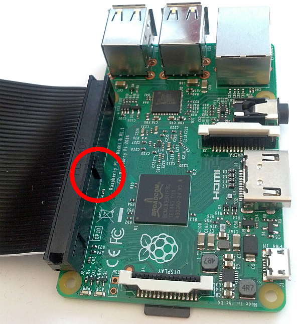
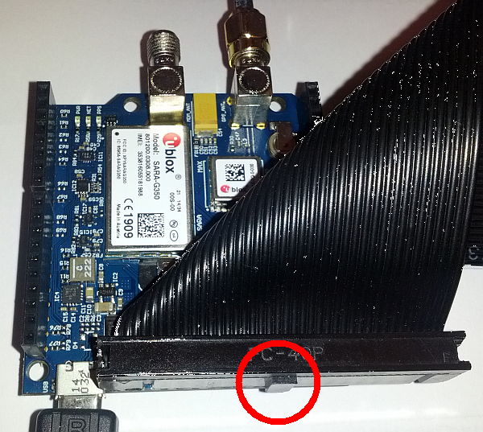
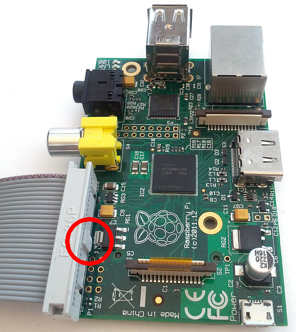
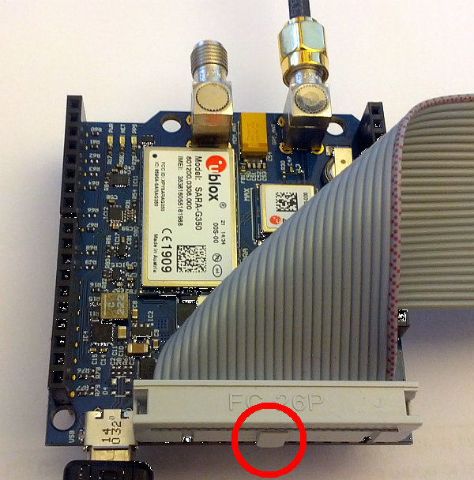

# I2C driver Cellular and Positioning Shield on Raspberry Pi

Table of contents

* [Background](#background)
* [Solution](#solution)
* [Connecting Raspberry Pi to the shield](#connecting-raspberry-pi-to-the-shield)
* [Code](#code)
* [Compiling](#compiling)
* [Running](#running)
* [Output](#output)

## Background
The [2.5G/GSM](http://www.embeddedartists.com/products/acc/cell_pos_shield.php) and [3G/UMTS](http://www.embeddedartists.com/products/acc/cell_3g_pos_shield.php) Cellular and Positioning Shields by [Embedded Artists](http://www.embeddedartists.com/) both have GPS/GNSS modules by [u-blox](http://u-blox.com/).

Using the I2C interface to the GPS/GNSS module on a Raspberry Pi (1 or 2) is a bit tricky as the I2C driver on the Raspberry Pi doesn't support clock stretching. Clock Stretching is described like this on [wikipedia](https://en.wikipedia.org/wiki/I%C2%B2C#Clock_stretching_using_SCL):

*One of the more significant features of the I²C protocol is clock stretching. An addressed slave device may hold the clock line (SCL) low after receiving (or sending) a byte, indicating that it is not yet ready to process more data. The master that is communicating with the slave may not finish the transmission of the current bit, but must wait until the clock line actually goes high. If the slave is clock stretching, the clock line will still be low (because the connections are open-drain). The same is true if a second, slower, master tries to drive the clock at the same time. (If there is more than one master, all but one of them will normally lose arbitration.)*

The u-blox GPS/GNSS modules use clock stretching to let the master (the Raspberry Pi) know if there is data to read or not.

The I2C driver can be made to work by lowering the bitrate to <= 10Kbit/s and discarding invalid incoming data. A better solution to the problem is described below.

## Solution
An alternative to using the I2C driver on the Raspberry Pi is to implement I2C using bit banging. Bit banging is described like this on [wikipedia](https://en.wikipedia.org/wiki/Bit_banging):

*Bit banging is a technique for serial communications using software instead of dedicated hardware. Software directly sets and samples the state of pins on the microcontroller, and is responsible for all parameters of the signal: timing, levels, synchronization, etc.*

## Connecting Raspberry Pi to the shield
### Raspberry Pi 2, A+ and B+ models

The A+, B+ and version 2 models come with 40 gpio pins. You can use a 40-pin ribbon cable and connect part of it like this:

Note that the keying must be as shown in the images for the pins to align correctly. As the cable is 40 pins and the pin list is 26, 14 pins will stick out. Make sure they stick out on the side as shown above.

###  Raspberry Pi A and B models

The A and B models come with 26 gpio pins. You can use a 26-pin ribbon cable and connect it like this:

Note that the keying must be as shown in the images for the pins to align correctly.

## Code
The code in this repository is based on a solution documented [here](http://doc.byvac.com/index.php5?title=RPI_I2C) which points to the following code [http://www.byvac.com//downloads/Pi/bcm2835_i2cbb.zip](http://www.byvac.com//downloads/Pi/bcm2835_i2cbb.zip) which has also been downloaded to this repo in case the link is broken.

The original code has been modified:
* Added a Makefile
* Added support for both Raspberry Pi 1 and 2
* Added crash fix
* Added header file for bcm2835_i2cbb.c and moved some desclarations there
* Added gps.c file as example of usage
 
## Compiling

~~~~~
git clone https://github.com/embeddedartists/gps_shield.git
cd gps_shield
make
~~~~~

## Running

~~~~~
cd gps_shield
sudo ./gps
~~~~~

The example program has a default bitrate of ca 100Kbit/s. This can be changed by passing an optional parameter to the gps program. The following will use a bitrate of ca 400Kbit/s.

~~~~~
cd gps_shield
sudo ./gps 400
~~~~~

## Output

The data from the GPS/GNSS module is repeated over and over. The printouts from the program looks something like this:

~~~~~
Got message '$GPGGA,103156.00,5535.92197,N,01259.99453,E,1,04,4.86,-2.5,M,38.9,M,,*75'
Got message '$GPGSA,A,2,19,17,06,09,,,,,,,,,4.96,4.86,1.00*02'
Got message '$GPGSV,4,1,13,01,22,157,,02,04,318,,03,62,101,,06,39,302,29*71'
Got message '$GPGSV,4,2,13,09,33,221,22,11,02,166,,12,02,328,,17,24,245,11*7D'
Got message '$GPGSV,4,3,13,19,24,238,27,23,67,193,09,25,08,003,,31,26,046,20*76'
Got message '$GPGSV,4,4,13,32,25,096,16*45'
Got message '$GPGLL,5535.92197,N,01259.99453,E,103156.00,A,A*66'
Got message '$GPRMC,103157.00,A,5535.92195,N,01259.99610,E,1.782,97.72,110116,,,A*56'
Got message '$GPVTG,97.72,T,,M,1.782,N,3.301,K,A*0B'
~~~~~

The example program verifies that the checksum is correct but doesn't do anything further with the data. For a complete reference to the GPS/GNSS commands see the u-blox documentation for the module, e.g. [u-blox 7
Receiver Description
Including Protocol Specification V14](https://www.u-blox.com/sites/default/files/products/documents/u-blox7-V14_ReceiverDescrProtSpec_%28GPS.G7-SW-12001%29_Public.pdf)
